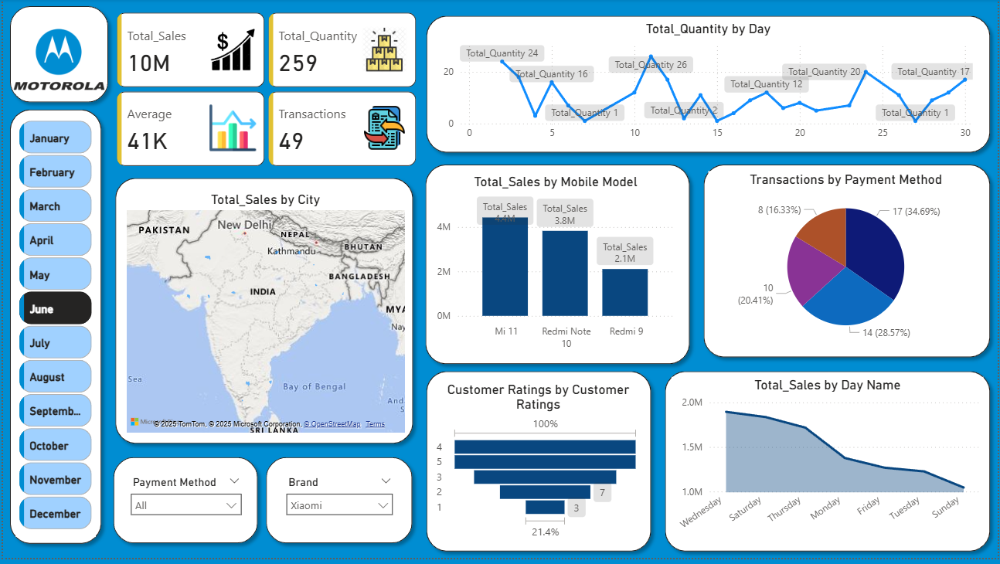

📊 Motorola-Sales-Performance-Dashboard 
📌 Project Objective
The objective of this project was to analyze Motorola’s monthly sales performance for the year, providing key insights on total sales, customer behavior, product-wise performance, and regional contributions — helping management make data-driven decisions for future business growth.

📁 Dataset Used
Motorola Sales Data (Sample)

Includes data related to transactions, product models, payment methods, cities, customer ratings, and total sales.

📊 Questions / KPIs Addressed
📈 What is the total sales, total quantity sold, average sales, and number of transactions for the selected month?

📅 What is the daily trend of total quantities sold?

🗺️ Which cities contributed most to the sales?

📱 Which mobile models generated the highest sales?

💳 What is the breakdown of transactions by payment method?

🌟 What is the distribution of customer ratings?

📊 How do total sales distribute across days of the week?

📆 Enable month-wise selection for dynamic analysis.

⚙️ Process
Data Cleaning & Preparation

Verified dataset for missing values, duplicates, and inconsistencies.

Standardized data formats and ensured clean, reliable data.

Dashboard Creation

Created interactive visualizations using Microsoft Power BI.

Designed key charts including bar charts, pie charts, line charts, maps, and KPIs.

Applied slicers for month-wise dynamic filtering and brand/payment method filters.

Linked multiple visuals to create an interactive, user-friendly dashboard.

📊 Dashboard Overview
Key Visuals:

KPI Cards: Total Sales, Total Quantity, Average Sales, Transactions.

Line Chart: Daily Quantity Sold Trend.

Map: City-wise Sales Distribution.

Bar Chart: Sales by Mobile Model.

Pie Chart: Transactions by Payment Method.

Bar Chart: Customer Ratings Distribution.

Line Chart: Sales by Day Name.

Month and Filter Slicers: For interactive analysis.

📸 Dashboard Screenshot:

📌 Project Insights
Total Sales: ₹10 Million with 259 units sold.

Best-Selling Models: Mi 11 (₹4.2M), Redmi Note 10 (₹3.8M), and Redmi 9 (₹2.1M).

Highest Transaction Day: Day 12 with 26 units sold.

Preferred Payment Method: Method 1 (~35% of transactions).

Customer Ratings: Majority gave 4 and 5-star ratings.

Top Sales Day: Wednesday.

Geographical Sales: Major sales concentrated around New Delhi and surrounding cities.

📌 Final Conclusion
This Power BI dashboard successfully visualizes Motorola’s monthly sales performance with clear, interactive, and dynamic visuals, offering valuable business insights. The analysis highlights the top-selling products, preferred payment methods, key sales regions, and customer satisfaction trends — providing a reliable decision-support tool for business growth and operational strategy.

